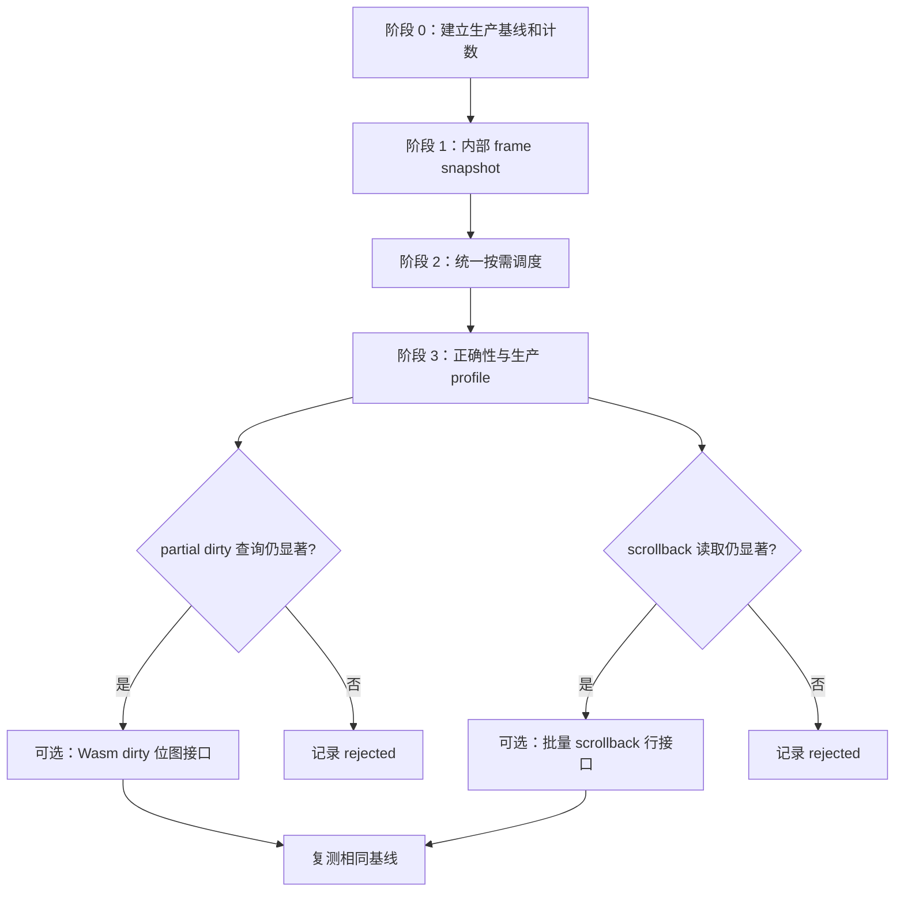

# 终端渲染性能优化计划修订版

> 本文件是 `PLAN-terminal-render-perf.md` 的独立修订版。原文件保留用于对照。
>
> 范围：`references/ghostty-web` 的终端渲染、调度和 Wasm 读取路径，以及 `scripts/perf` 中用于验证该路径的生产构建性能场景。

## 一、目标和证据边界

### 1.1 已由代码确认的现状

当前代码存在以下结构性重复工作。这些事实说明优化假设值得测量，但尚未证明它们是用户可感知性能问题的主要来源。

| 现状                                                                                      | 代码依据                                                                             |
| ----------------------------------------------------------------------------------------- | ------------------------------------------------------------------------------------ |
| `Terminal.startRenderLoop()` 持续安排下一次 rAF，空闲时也调用 `render()`                  | `references/ghostty-web/lib/terminal.ts:1201-1227`                                   |
| `GhosttyTerminal.getLine()` 每次执行 `update()`、整视口 `getViewport()`，随后深拷贝目标行 | `references/ghostty-web/lib/ghostty.ts:517-525`                                      |
| `CanvasRenderer.render()` 的逐行绘制、光标底层字符和 hyperlink ID 扫描会调用 `getLine()`  | `references/ghostty-web/lib/renderer.ts:349-440, 489-524, 889-909`                   |
| `getViewport()` 每次让 Wasm 写出整个 active viewport，并在 JS 中解析全部 cell             | `references/ghostty-web/lib/ghostty.ts:477-505, 809-829`                             |
| selection 和 link hover 的重绘目前依赖常开循环，主动调度接口尚未建立                      | `references/ghostty-web/lib/selection-manager.ts:1077-1086`, `terminal.ts:1433-1539` |
| cursor blink 已由 530ms timer 驱动状态切换，但 timer 本身不请求绘制                       | `references/ghostty-web/lib/renderer.ts:932-950`                                     |
| `getScrollbackLine()` 每次只取一行，但为该行创建数组和 cell 对象                          | `references/ghostty-web/lib/ghostty.ts:587-639`                                      |

### 1.2 尚未确认的事项

以下结论必须由生产构建 profile 或操作计数证明，不能从代码形态直接推定：

- 重复 viewport 提取在真实终端输出中的 CPU 占比。
- 永久 rAF 对 OpenChamber 空闲 CPU 的实际贡献。
- partial dirty 状态下逐行 `isRowDirty()` 是否值得新增 Wasm 批量接口。
- 滚动时 scrollback 行读取是否达到需要修改 Wasm API 的成本阈值。
- `JSON.stringify()` 比较是否对目标指标有可测影响。

### 1.3 性能契约

| 维度            | 契约                                                                                                       |
| --------------- | ---------------------------------------------------------------------------------------------------------- |
| 交互            | 持续输出、全屏 TUI、滚动、拖选、链接 hover 和光标闪烁保持响应                                              |
| 规模            | 基准至少覆盖 80×24；另测一个更大且固定的网格，例如 160×50                                                  |
| 路径            | Wasm VT 更新、共享线性内存读取和 canvas 绘制均在浏览器主线程                                               |
| 调度            | 没有输出、交互、动画或 blink invalidation 时，不保留持续 rAF                                               |
| active viewport | 一次需要 active-screen cell 内容的 render transaction 最多执行一次完整 viewport 提取和解析                 |
| 兼容性          | 公开 `getLine()` 和 xterm 兼容 `BufferLine` 保持稳定副本语义；内部 pool 生命周期不得泄漏给外部调用者       |
| 正确性          | dirty、光标、selection、hover、scroll、resize 和 dispose 的时序保持一致，不得清除尚未成功绘制的 dirty 状态 |

## 二、当前成本模型

对 80×24、active viewport 全脏、block cursor 可见且没有 hover 状态变化的帧，当前实现通常包含：

```text
逐行绘制 getLine                 24 次
block cursor 读取底层字符         1 次
每次 getLine 的完整 viewport      1,920 cells
完整 viewport 写出及解析          至少 25 × 1,920 = 48,000 cells/帧
逐行 deep-copy                    至少 25 × 80 = 2,000 cell 对象/帧
```

hyperlink ID 变化时，renderer 还可能在正式绘制前逐行调用 `getLine()`。启用 cursor blink 后，空闲帧也可能执行额外光标行读取。

计数时必须区分：

- Wasm export 调用次数。
- Wasm 写入共享线性内存的 cell 数和字节数。
- JS 解析的 cell 数。
- JS 创建的 per-cell 对象数。
- JS 创建的 per-row 数组数。
- rAF 被请求、合并和实际执行的次数。

“cell 数”不等同于“Wasm 边界调用次数”。

## 三、目标设计

### 3.1 单次 render transaction

一次 render transaction 按以下顺序执行：

1. `update()` 一次，取得 `DirtyState`。
2. 合并 VT dirty 与 UI-only invalidation，例如 selection、hover、scrollbar、viewport 和 cursor blink。
3. 若两类 invalidation 均为空，结束 transaction，不读取 viewport，不调用 `clearDirty()`。
4. 根据 dirty 状态确定行集合：
   - `FULL`：全部 active rows，不逐行查询 dirty。
   - `PARTIAL`：查询 dirty rows，并合并相邻 overflow rows 与 UI-only rows。
   - `NONE`：只处理 UI-only rows。
5. transaction 需要任何 active-screen cell 时，调用一次 `getViewport()`。
6. 所有 active-screen 行、光标底层字符和 hyperlink ID 扫描都从同一 pool 与 offset 读取。
7. scrollback 行继续通过独立 provider 读取，不伪装成 active viewport snapshot。
8. 绘制成功后才清除本 transaction 已消费的 dirty 和 UI invalidation。
9. transaction 执行期间若出现新 invalidation，再安排下一帧。

### 3.2 内部 snapshot，不改变公开 API

新增 renderer 专用内部读取契约。公开 `GhosttyTerminal.getLine()` 继续返回稳定副本。

内部 API 必须满足：

- pool 只在当前同步 transaction 内有效。
- `renderLine` 接收 `cells + offset + length`，不调用 `Array.prototype.slice()`。
- block cursor 直接读取 `cells[cursor.y * cols + cursor.x]`。
- hyperlink ID 扫描直接读取同一个 pool。
- renderer 内不再调用公开 `getLine()` 或第二次 `getViewport()`。
- resize 或 Wasm memory growth 后重新创建 TypedArray/DataView 视图，不跨 transaction 保存它们。

不要把 pool-backed line 暴露给 `BufferLine`、selection、异步 link provider 或外部 xterm 兼容调用者。

### 3.3 单一按需调度器

由 `Terminal` 持有唯一的 `scheduleRender(reason)`。它把同一事件循环内的多个请求合并成最多一个待处理 rAF。

所有会改变画面的路径都迁移到这个调度器：

- terminal write 和 resize 后的 queued writes。
- 初始绘制、reset、font 和 renderer option 变化。
- selection 创建、移动、清除、双击、三击和自动滚动。
- hyperlink ID 与 regex link range 的 enter、move 和 leave。
- `scrollLines()`、`scrollToTop()`、`scrollToBottom()`、`scrollToLine()`。
- smooth scroll 的每个动画步。
- cursor blink timer。
- scrollbar fade。

调度器必须保留以下行为：

- 多次同步 `write()` 只安排一个 rAF。
- write callback 在包含对应写入的 render 完成后运行。
- `dispose()` 和 `resize()` 能取消旧 frame；旧 frame 不得读取已重分配的 Wasm buffer。
- render 中产生的新请求不会被当前 transaction 清掉。
- cursor move event 在 transaction 读取新 cursor 后触发，不再依赖常开轮询。
- smooth scroll 和 scrollbar fade 不建立第二套终端 render loop。动画只更新状态并调用统一调度器。

### 3.4 cursor blink

保留现有约 530ms timer，但改为显式 invalidation：

- timer 只切换 cursor visibility 并请求光标相关行重绘。
- `cursorBlink=false`、失焦、不可见或 dispose 时停止无效 timer/调度。
- cursor 显示和隐藏都重绘光标行，保证底层字符恢复。
- blink 开启时允许约 2 次/秒的 render，不允许恢复 60fps 空转。

## 四、实施阶段



### 阶段 0：建立有效基线

#### 0.1 构建路径

性能测量必须使用包含当前 ghostty-web 源码的生产产物：

1. 修改 TypeScript 时，先重建 `references/ghostty-web` 的库产物。
2. 修改 `patches/ghostty-wasm-api.patch` 或 Zig API 时，执行 ghostty-web 完整 Wasm 构建并更新 `ghostty-vt.wasm`。
3. 再执行 OpenChamber `build:web`。
4. 用生产 server 承载该产物。

仅运行 `build:web` 不足以证明它没有消费 `references/ghostty-web/dist` 中的旧代码。基线工具必须记录产物标识或操作计数，以证明加载的是目标构建。

#### 0.2 测量场景

在 `scripts/perf` 新增可重复的 terminal 场景，或扩展已有 profiler。场景至少包含：

- idle，终端已挂载，cursor blink 关闭。
- idle，终端聚焦且 cursor blink 开启。
- 固定字节数和固定 ANSI 序列的连续输出。
- 固定次数的全屏 TUI 重绘。
- 固定距离的 scrollback 滚动。
- 固定路径的拖选。
- hyperlink ID 与 regex URL 的 hover enter/leave。
- `--then-tab` 离开终端视图后的 idle 状态。

工作负载使用仓库控制的确定性 fixture，不依赖系统是否安装 `yes`、`htop` 或 Vim。每次运行断言：

- 终端 canvas 已挂载。
- fixture 写入字节数达到预期。
- renderer 操作计数发生变化。
- Chrome 没有背景或遮挡节流。
- trace 中存在预期任务类别。

每个场景在未修改的同一生产构建上重复运行，记录中位数和 p95/max。输出量不同的场景按写入字节数、更新次数或帧数归一化。

#### 0.3 操作计数

计数器至少覆盖：

- render schedule requests、coalesced requests、executed transactions。
- `update()`、`getViewport()`、`getLine()`、`getScrollbackLine()`。
- `isRowDirty()`。
- viewport 和 scrollback 解析 cell 数。
- compatibility line 克隆 cell 数。
- 每帧实际绘制行数。

计数器应只在测试或 profiler 模式启用，不能改变正常行为或成为生产热路径成本。

完成条件：相同生产构建的重复结果可比较，所有零值都由独立 workload 信号证明不是失效仪器。

### 阶段 1：内部 frame snapshot

#### 1.1 GhosttyTerminal

- 提供 renderer 内部使用的 `update()`、cursor、dimensions 和 viewport pool 读取组合。
- `getViewport()` 仍复用既有 Wasm buffer 与 cell pool。
- 保留公开 `getLine()` 的深复制语义。
- viewport 获取失败时返回显式失败，调用者不得继续清 dirty。

#### 1.2 CanvasRenderer

- 一次 transaction 最多读取一个 active viewport。
- `renderLine()` 改为读取 pool offset，避免 per-row array。
- 光标底层字符和 hyperlink ID 扫描读取同一 pool。
- `DirtyState.NONE` 且无 UI invalidation 时直接结束。
- `DirtyState.FULL` 时跳过逐行 dirty 查询。
- 清 dirty 发生在成功绘制之后。

完成条件：80×24 全 active-screen 重绘 transaction 的操作计数满足：

```text
update                 = 1
getViewport            <= 1
parsed viewport cells  <= 1,920
renderer getLine       = 0
per-row cell arrays    = 0
per-cell line clones   = 0
```

此条件不宣称整个 render 函数零分配。`Set`、状态对象和 CSS 字符串等剩余分配由 allocation profile 单独记录。

### 阶段 2：统一按需调度

- 实现 `scheduleRender(reason)` 和 transaction 内新请求保护。
- 迁移第三节列出的全部画面变更源。
- 删除 `startRenderLoop()` 的永久自续循环。
- cursor blink timer、smooth scroll 和 scrollbar fade 只更新状态并请求统一 render。
- selection 的 `requestRender()` 从空实现改为调用 Terminal 提供的调度接口。
- hover 状态变化立即调度，不依赖下一次输出或永久循环。

完成条件：

- cursor blink 关闭的 idle 终端在稳定后没有终端来源的持续 rAF。
- cursor blink 开启时，render 频率与 blink 周期一致，不是显示刷新率。
- 连续同步 writes 合并到一个待处理 frame。
- 普通 `scrollToLine()`、selection 和 hover 在没有其他输出时也能更新画面。
- dispose、resize 和 render 中再次 invalidation 的时序测试通过。

### 阶段 3：验证和取舍

先完成阶段 1 和 2 的前后对比。只有剩余 profile 证明需要时，才实施以下可选项。

#### 可选 A：dirty rows 批量接口

仅当 `PARTIAL` 场景中逐行 `isRowDirty()` 仍占目标预算的显著部分时实施。

接口必须由 JS 提供复用输出缓冲区，例如：

```text
ghostty_render_state_get_dirty_rows(handle, outPtr, capacity) -> count
```

也可以返回固定大小位图。接口必须定义 capacity、返回值、FULL/NONE 行为、越界行为和 buffer 生命周期。

#### 可选 B：批量 scrollback 行接口

仅当滚动 profile 证明逐行 `getScrollbackLine()` 的 Wasm 调用、解析或分配仍显著时实施。接口读取一个连续 scrollback 区间，并让 renderer 从复用 pool 与 offset 绘制。

该优化独立于 active viewport snapshot，不能通过复用 `getViewport()` 假装覆盖历史行。

#### 小型候选：link range 比较

可以把 `hoveredLinkRange` 的 `JSON.stringify()` 改为 null-safe 字段比较。该改动只有在目标指标变化或作为同一正确性改动的必要组成部分时保留；否则记录为 rejected。

## 五、正确性验证

### 5.1 自动化契约

在现有测试基础上覆盖：

- 全脏 transaction 只取一次 active viewport。
- FULL 状态不逐行查询 dirty，PARTIAL 只绘制目标行和必要相邻行。
- viewport 获取失败时不清 dirty。
- block cursor 不调用 `getLine()`，显示和隐藏都恢复正确底层字符。
- 多次同步 write 合并为一个 frame。
- write callback 在对应 render 后执行。
- clean 状态不会自行继续安排 frame。
- selection 创建、移动和清除会主动调度。
- hover enter、move、leave 会主动调度。
- `scrollToLine()` 和 smooth scroll 会调度，且不存在并行终端 render loop。
- cursor blink 的 fake timer 测试只产生 blink 周期 render。
- focus、blur、可见性和 runtime option 变化正确启动或停止 blink。
- dispose 和 resize 取消旧 frame；旧 pool 不在 resize 后使用。
- render 中新增 invalidation 会保留到下一帧。
- public `getLine()` 返回值不会因后续 `getViewport()` 而变化。
- 异步 link provider 和 `BufferLine` 不观察到 pool 的后续突变。
- scrollback 内容、选择、grapheme、alternate screen 和 viewport corruption 测试保持通过。

至少运行：

- `references/ghostty-web/lib/terminal.test.ts`
- `references/ghostty-web/lib/renderer.test.ts`
- `references/ghostty-web/lib/viewport-corruption.test.ts`
- `references/ghostty-web/lib/selection-manager.test.ts`
- `references/ghostty-web/lib/buffer.test.ts`
- link provider 和 link detector 的相关测试

### 5.2 真实表面验证

使用实际 OpenChamber 生产 Web UI，验证：

- 持续构建日志。
- alternate-screen TUI 的进入、更新和退出。
- scrollback 滚动及 scrollbar fade。
- 单行和多行拖选、复制、清除。
- OSC 8 与普通 URL hover、leave、click。
- block、bar、underline cursor，以及 blink 开关。
- resize、字体变化、终端隐藏后返回。

视觉检查和性能 profile 分开记录。单元测试不能替代 canvas 视觉检查，采样 profiler 也不能证明渲染等价。

## 六、验收标准

### 6.1 必须满足

- 相同生产构建、相同 fixture 的前后结果可比较，测量有效性检查通过。
- 需要 active-screen 内容的 transaction 最多一次 `getViewport()` 和一次整视口解析。
- renderer 不通过公开 `getLine()` 读取 active-screen 行。
- 逐行绘制不创建 per-row cell 数组或 per-cell 克隆。
- cursor blink 关闭且无交互时，没有终端来源的持续 rAF。
- cursor blink 开启时，只按 blink invalidation 绘制。
- 所有画面变更源都通过统一调度器更新，不依赖永久循环。
- 公开 xterm 兼容读取保持稳定副本语义。
- 自动化正确性契约和实际 canvas 场景通过。

### 6.2 必须报告，不预设绝对值

- idle 主线程 busy time 和终端来源 rAF 次数的前后差异。
- 固定输出量下的 median、p95/max frame 或 long-task 指标。
- `update()`、viewport 提取、解析 cell 和 line clone 的前后计数。
- allocation profile 中剩余主要分配源。
- 大网格相对 80×24 的缩放情况。

不要使用“CPU 约等于 0”或“整个渲染路径零对象分配”作为验收标准。

### 6.3 回退纪律

- 未移动其目标指标的性能改动回退。
- R4、批量 scrollback 和 link-range 比较都属于测量后候选，不是默认实施项。
- 回退项记录测试场景、前后数字和 rejected 原因，避免以后重复同一假设。

## 七、非目标

本计划不处理：

- canvas 字形绘制算法或字体视觉重设计。
- terminal VT 语义、输入编码或网络传输优化。
- 对外 `getLine()` 的破坏性零拷贝 API。
- 未经 profile 证明的缓存、worker 或额外全局状态。
- 为达到“零分配”而重写与本次主要乘数无关的 renderer 辅助代码。
