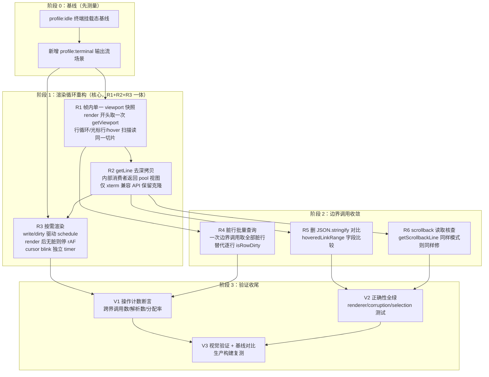

# 终端渲染性能优化计划（ghostty-web VT 跨 wasm 拷贝消除）

> 范围：`references/ghostty-web`（fork 分支 `terminal-enhancer`）。数据已核实到代码行，非推测。

## 一、原因分析

### 1.1 现状数据流（每帧实际执行路径）

```
startRenderLoop()                       terminal.ts:1192
  └ requestAnimationFrame 常开循环      ← 空闲也每帧执行，永不停止
     └ renderer.render()                renderer.ts:312
        ├ L404  JSON.stringify(hoveredLinkRange) × 2     ← 每帧，纯对比用
        ├ L474  for y: buffer.isRowDirty(y)              ← 每行一次 wasm 边界调用
        └ L490  for y in rowsToRender:                   ← 逐行渲染
            └ buffer.getLine(y)                          buffer.ts:164
              └ wasmTerm.getLine(y)                      ghostty.ts:482
                  ├ this.update()                        ← wasm 边界 #1（每行）
                  ├ this.getViewport()                   ← 每行调用一次！
                  │   ├ get_viewport(handle, ptr, 1920)  ← wasm 边界 #2：
                  │   │                                     全视口 cells 线性拷出
                  │   └ parseCellsIntoPool(1920 cells)    ← 每行都解析整个视口
                  │                                         （每 cell 15 字段读取）
                  └ slice().map(cell => ({...cell}))      ← 再深拷贝该行全部 cell 对象
```

### 1.2 根因：三层重复叠加

| 层 | 问题 | 证据 |
|---|---|---|
| **L1 逐行全视口拷贝** | `getLine(y)` 内部无条件调 `getViewport()`——取 1 行也要把整个视口（cols×rows）从 wasm 内存拷出并解析。渲染一帧 24 行 = 24 次整屏拷贝，23 次纯重复 | ghostty.ts:487 `const viewport = this.getViewport()` 在 `getLine` 内 |
| **L2 逐行对象深拷贝** | `getViewport()` 返回的 cellPool 本身就是零分配复用池（注释写明 "reusable cell array (zero allocation after warmup)"），但 `getLine` 出口处 `slice().map(({...cell}))` 把设计优势完全抵消——每行克隆 80 个 15 字段对象 | ghostty.ts:490 |
| **L3 常开渲染循环** | rAF 循环无条件每帧跑 `render()`，无脏行判断的 early-exit 在 stringify 和逐行 isRowDirty 之后；空闲终端持续消耗 CPU（每帧 24 次边界调用 + 2 次 JSON.stringify），浏览器无法判定"无动画"进入低功耗 | terminal.ts:1194-1218 |

### 1.3 成本方程

最坏帧（24 行全脏：vim 打开、cat 大文件、TUI 全屏重绘）：

```
边界跨界拷贝：  24 × 1920 cells   = 46,080 cell 跨界/帧   （95% 重复）
cell 解析：     24 × 1920 cells   = 46,080 cell 解析/帧
对象分配：      24 × 80 objects   = 1,920 短命对象/帧     （GC 压力）

60fps 输出流（yes / cat / 构建日志）：
  ≈ 2.7M cell 解析/秒 + 115K 对象分配/秒，全部主线程
```

### 1.4 同模式扩散点（必须一并修，否则修一半）

| 调用点 | 位置 | 触发场景 |
|---|---|---|
| 光标行对比 ×2 | renderer.ts:356, 364 | 每帧 |
| hyperlink hover 全行扫描 | renderer.ts:406-440 | hover 变化时，每行又一次整屏拷贝 |
| selection 读取 ×3 | selection-manager.ts:152, 648, 948 | 鼠标拖选 |
| link 检测 ×2 | terminal.ts:1413, 1417 | 输出后检测 |
| link-detector | link-detector.ts:41 | 逐行 |
| scrollback 行读取 | buffer.ts:185 → getScrollbackLine | 滚动重绘（待核查实现） |

## 二、实施计划

### 阶段划分与依赖



### R1 帧内单一 viewport 快照（最大收益）

- `render()` 入口调用一次 `wasmTerm.update()` + `getViewport()`，得到 cellPool 引用
- 行渲染循环改为读 `pool[y*cols .. y*cols+cols]` 切片（零拷贝视图）
- 光标行对比、hyperlink hover 扫描、selection、link 检测全部改为接受快照参数
- 渲染循环内**禁止**出现 `getLine` / `getViewport` 调用（可加 dev 断言）
- 收益：跨界拷贝 24×→1×/帧；解析 46K→1.9K/帧

### R2 getLine 去深拷贝

- `ghostty.ts getLine` 删除 `slice().map(({...cell}))`
- 生命周期契约：pool 内容在下一次 `getViewport()` 前有效；消费者必须即时消费（渲染/检测/选择均满足）
- `buffer.ts` 对外 xterm 兼容 API（`BufferLine`）如需跨帧持有，由调用侧显式克隆并注释原因

### R3 按需渲染（停掉常开 rAF）

- write 路径喂 wasm 后检查 `DirtyState`：有脏 → schedule rAF；无脏 → 不排
- `render()` 末尾 dirty 清空后无新写入 → 循环自然停止
- cursor blink 改独立低频 timer（~500ms），只重绘光标行
- 空闲终端 CPU 归零；滚动动画期间的临时循环保留（scrollToLine 已有自己的帧循环 terminal.ts:1839+）

### R4 脏行批量查询

- wasm 侧导出 `ghostty_render_state_get_dirty_rows(ptr)` 一次返回脏行位图/数组
- `render()` 用一次边界调用替代 L474 的逐行 `isRowDirty`
- 若 wasm 侧改动成本高，退路：`update()` 返回 DirtyState，NONE 时 render 入口直接 return（配合 R3 后空闲帧不存在，此退路收益已大半）

### R5 / R6（顺手项，随阶段 2）

- R5：`hoveredLinkRange` 对比改字段级比较，删每帧 2 次 `JSON.stringify`
- R6：核查 `getScrollbackLine` 实现；若同样逐行跨界+克隆，套用 R1/R2 同方案

### 验证契约

| 项 | 要求 |
|---|---|
| 基线 | 阶段 0 先抓：`profile:idle` 终端面板挂载 + `--then-tab` 离开态；改前数字存 `artifacts/` |
| 终端场景 | `scripts/perf` 新增 `profile:terminal`（输出流 + 滚动 + 拖选），扩展工具而非手测 |
| 操作计数 | 每帧 wasm 边界调用数 / cell 解析数 / 分配率，R1 前后断言对比 |
| 正确性 | renderer.test / viewport-corruption.test / selection-manager.test / buffer.test 全绿 |
| 视觉 | 浏览器实测：vim / htop / cat 输出 / 拖选 / hover 链接，逐场景对比改动前后渲染结果 |
| 生产构建 | 全部数字来自 `build:web` 产物，dev build 不算数 |
| 回退纪律 | 不动指标的改动回退并记录为 rejected |

### 完成定义

- 最坏帧（全行重绘）跨界 cell 拷贝 ≤ 1×视口，cell 解析 ≤ 1×视口，渲染路径零对象分配
- 空闲终端（无输出、无交互）rAF 循环停止，profile:idle 终端态 CPU ≈ 0
- 全部既有测试绿 + 视觉验证通过
