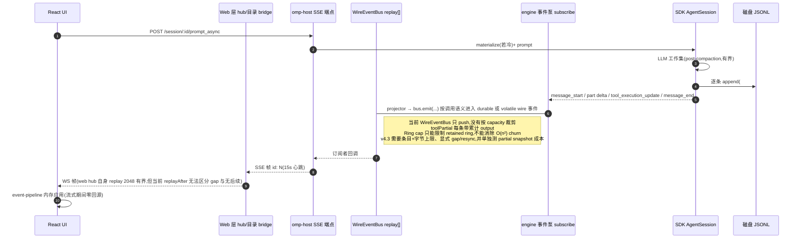
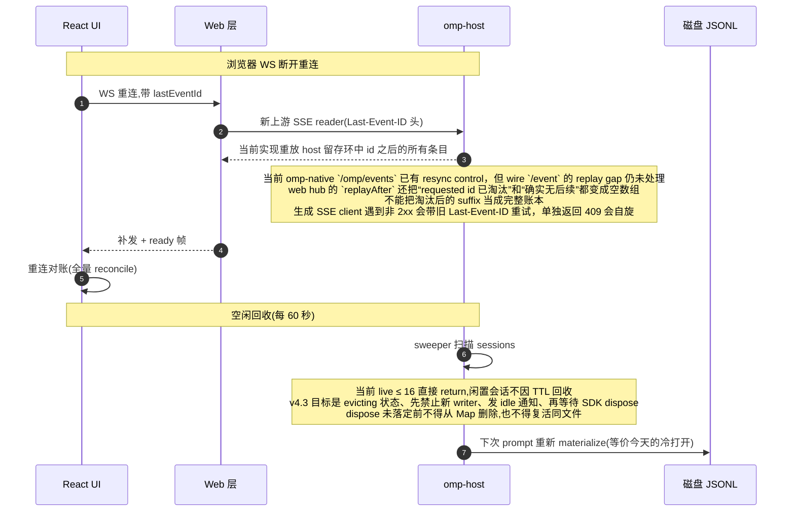

# omp-host 内存问题:链路、概念与病灶记录

状态说明:本文是**阶段 0-4 修复前的基线证据记录**,不是当前代码的描述——下文"二级"表格里引用的行号与代码形态对应打补丁前的工作树,当前实现以 `docs/plan.md` v4.3 及各模块为准。不修改 SDK。文中把 leak、retention、churn 和 SDK writer 成本分开。即使 Wire ring 与 idle session 修复完成，`wireIdOverrides` 的长会话增长仍是独立阻塞项。历史 stash 不视为当前代码。

## 概念(大白话)

### lease(租约)= "这个页面正开着"的心跳申报

浏览器里每打开一个会话的聊天页,UI 就往服务端申报一次:"我(`/repo` 目录的 `s2` 会话)有页面正开着"。之后每隔几秒再报一次(心跳);关掉页面就申报离开。

它存在的本来目的:agent 跑工具时要弹"是否允许执行 bash?"这种审批框,服务端得知道**有没有真人在看着**。有人看着(hasUI = true)就等回答;没人看着就按无头模式处理。连续漏报三次心跳,租约自动作废。

当前代码的问题：**“点开看一眼”也会创建租约**，而代码把“有租约”当成“把整个会话在内存里建起来”的理由。租约的本意是给审批工具判断是否有人值守，不应自动等同于永久保留 writer。

### materialize(实体化)= 把磁盘上的会话文件变成内存里能跑的对象

一个会话有两种存在形态:

- **冷的**:只是磁盘上的一个 `.jsonl` 文本文件,进程里没有它的任何东西;
- **活的(实体化之后)**:进程里建起了完整的 SDK 运行对象——整个转录被解析成对象数组、挂上模型上下文、工具、扩展运行器,可以真正"跑一轮对话"。

实体化有真实用途:发消息、压缩历史、回退,都得有活对象。代价是**整个转录文件被解析进内存**。对一个 84 MB 样本,此前隔离实验观察到约 311 MB 的解析对象,这是单文件成本,不是 host 总 retained 的测量。

问题不在实体化本身,在**触发条件和回收时机**:当前代码是"看一眼就实体化"加"攒够超过 16 个才开始回收",两天里点开过的大会话可能一直躺在内存里。v4.3 保留需要扩展/UI context 的 attach 语义,但移除数量闸,用活动守卫和 30 分钟 idle TTL 回收;这不是 SDK writer 的窗口化。

### turn-state(每轮状态)= "这条消息当时用的是什么模型"

UI 里每条历史消息旁边标注的模型、思考档位,SDK 存消息时**不在消息身上记**,而是把"第 X 条之后模型从 A 换成 B"当成独立的变更日志条目存进转录文件。

想知道"第 5 条消息发出时用的是什么模型",必须从文件第一条变更记录开始一路重放:初始是 A → 读到"换成 B" → 之后的消息都盖 B 的章。这个"从头重放、盖章"的过程就是 turn-state 折叠——也是冷读要读整个文件的借口之一。

### 两个公式

**`msg_<role><时间戳><内容摘要>`** —— 消息 ID 生成公式。角色字母(u=用户/a=助手)+ 时间戳 + 内容摘要哈希。设计意图:同一条消息,从实时流算和从磁盘文件算,ID 永远相同——否则界面上显示两遍。

**`liveCount >= fileMessages.length`** —— "信内存还是信磁盘"的判断。内存里活会话的消息数 ≥ 磁盘文件的消息数,用内存的,否则用磁盘的。原因:历史被压缩后,内存里的运行时上下文不完整(老消息折叠成了摘要),磁盘文件才是全史。而"比谁更全"要先数出文件里到底几条——这又成了读整个文件的理由之一。

### 速查表

| 词 | 意思 |
|---|---|
| lease / 租约 | 页面开着的心跳申报,服务端据此知道有没有人在看 |
| materialize / 实体化 | 把磁盘会话文件在内存里建成可运行的活对象(整份转录进内存) |
| 冷读 | 不建活对象、直接读文件回答请求 |
| turn-state 折叠 | 从头重放"模型/档位变更日志",给每条历史消息盖上它当时的配置 |
| `#entries` | SDK 活对象里那份完整的转录数组(写盘的源头) |
| replay ring / 留存环 | 事件总线的留存缓冲,供断线重连的客户端补账 |
| sweep / 清扫 | 定时器每 60 秒扫一遍，把满足 idle TTL 且没有活动的会话从内存里清掉（当前代码只有在 live 数超过 16 时才进入循环） |

## A. 打开会话(查看):冷读 + 租约附着

```mermaid
sequenceDiagram
    autonumber
    participant R as React UI
    participant N as Web 服务器 Node
    participant H as omp-host Bun engine
    participant K as SDK SessionManager
    participant D as 磁盘 JSONL

    Note over R,D: 用户在侧栏点开一个会话(不发消息)
    R->>N: GET /api/session/:id/message?limit=50
    N->>H: GET /session/:id/message (Basic)
    H->>K: SessionManager.open(path)
    K->>D: 读整个文件
    D-->>K: 全部字节
    Note right of K: #entries 全量解析(瞬态)<br/>buildSessionContext 第二份<br/>projectConversation 第三份<br/>paginateProjectedMessages 最后才切 50 条
    H-->>N: 50 条 JSON(84.1MB 样本:裸 open 约 5.0 秒;解析峰值与端到端请求分开测量)
    N-->>R: 50 条

    R->>R: ChatContainer 挂载 OmpDialogLayer
    R->>N: POST /omp/dialogs lease.acquire + 心跳
    N->>H: UiLeaseTable.acquire → onAttach
    H->>H: #attachDialogUi
    Note over H,K: 当前:sessions.get ?? materialize()<br/>→ engine 再 SessionManager.open 全量解析,经 sessionManager 参数注入 createAgentSession<br/>→ #entries 留在 live writer;切走只清 UI 接线,不回收<br/>→ sweeper 要求 live > 16 才动手<br/>v4.3:attach 仍可实体化,但用活动守卫和 30 分钟 idle TTL 回收,dispose 未完成不删 Map
```

**病灶 1 挂在最后一步(`#attachDialogUi` 的 materialize)**:查看这个动作会把磁盘文件变成进程内的 SDK writer。基准中最大的样本是 84.1 MB、8571 entries、裸 `open` 约 5.0 秒;此前隔离实验观察到约 311 MB 的解析对象只是单文件成本,不是当前 host retained 总量。最多 16 个会话约 2.7 GB 的数字仍是估算,不能当成 3 GB 工作集的拆账。

## B. 发消息(流式 turn):事件泵与留存环



**病灶 2 挂在 `bus.emit` 那一跳**:当前 `WireEventBus.emit` 的 replay 是确认存在的无界强引用,因此属于逻辑内存泄漏。它是 65 GB commit 的候选增长源,但单凭进程指标不能完成归因;partial snapshot 的重复拼接和解析 churn 也必须分别测量。

## C. 断线重连与空闲回收



## 为什么会出内存问题(总结)

磁盘 JSONL 是唯一权威存储,四个环节把它的影子搬进了内存,动机各不相同:

| 环节 | 内存里的东西 | 存在的目的 | 病 | 状态 |
|---|---|---|---|---|
| A·materialize | SDK `#entries` 全量解析 | 写盘的源头 + LLM 上下文 | 查看也触发;数量闸阻止闲置回收 | 当前确认是 writer 成本和 host retention 风险,不是单独的 leak;阶段 2 |
| B·host 留存环 | 每条 durable 事件的信封 | SSE 断线续传 | Wire ring 只增不减;partial snapshot 另有 churn | Wire 的无界强引用已确认;65 GB 归因未确认;阶段 1 |
| C·web hub replay | 跨 host SSE 与 UI WS 的传输缓冲 | 断线补发 | 只按条数裁剪且 requested id 被淘汰时静默返回空数组 | 有界但 gap 语义未完成;阶段 1 |
| D·冷读 | 全量解析的临时对象 | 生成显示投影 | 每请求重复 open;RSS 可能棘轮 | 分配成本已确认,不是 RSS 曲线意义上的 leak;阶段 3（§7.2 后 `getMessagesPage`/`getSession`/`getEntries` 走两遍扫描窗口读，`getTranscriptContext`/`#entryTreeFor` 仍是标注过的 full-materialization fallback） |

## 延伸问答(问题 A 的深挖)

### 每个 limit=50 的请求都全额重付吗?
是。当前 `#projectedMessages` 每次都“找文件 → 全量解析 → 拼完整列表 → 最后切一页 → 全部扔掉”。唯一可复用的部分只覆盖“找文件”的元数据，不覆盖解析本身。触发清单：初始页、每次“加载更早”、侧栏悬停预取、撤销/重做与队列确认后的尾部刷新、断网重连对账。这个结论说明分配成本和重复工作，不说明每次请求都会留下强引用。

1. **会话已经是活的也照样重开文件**——因为要先数出"文件里几条"才能跟内存比谁更全;活对象只省后面的拼装,省不了解析。
2. 客户端的请求合并只挡"同一瞬间",不挡"先后"隔几秒的两次请求;服务端读路径也没有"同请求合并"机制。

### 建 SessionManager 必须全文件读取吗?

分两半:

- **构造对象本身不需要**(`new SessionManager` 零 I/O;`inMemory()` 创建无文件的空管理者)。
- **恢复已有会话(`open`)按设计必须全读**——它是写者:追加先进内存数组再落盘,压缩/分支从内存数组全量重写文件,没有"半载入的写者"。

但**读数据从来不需要建管理者**:SDK 自己有头尾切片(目录列表,4KB 头 + 32KB 尾)、流式逐条访问(可提前停)、以及决定性的一点——冷读要的"完整消息视图"`buildSessionContext` 本体是**吃条目数组的纯函数**(session-context.ts:174),SessionManager 上的同名方法只是把自己 `#entries` 喂给它的薄包装。结论:全文件读取是**写者抽象的属性,不是数据的要求**;omp-host 冷读走了写者的门,成本是被那扇门要的。

### 会话超级长怎么办?

模型侧有界（上下文压缩把发给 LLM 的内容折叠成摘要）；**日志侧不缩小**。压缩只是往同一文件追加一条标记条目，老条目仍保留（显示全史、撤销都要用），常规缩小途径只有用户手动回退/分支（失败写入的原子回滚也会移除条目，属异常路径）。所以 `#entries` 随会话长度单调增长，单个活跃 writer 的内存没有 host 侧固定上限。这是 SDK 写者的设计成本，不是在不改 SDK 的前提下可消除的 leak。

### 冷读解析完不删,留给实体化复用行不行?

省一次解析(点开冷会话时同一文件确实被连续解析两遍),但"不删"= 引入缓存,三个代价:

1. **所有权**:看一眼就走的用户,他那份 311 MB 成了无人认领的驻留——绕回原点;
2. **失效**:回退/分支/压缩会重写文件,暂存对象会过期,需要"路径+大小+修改时间"判定;
3. **单写者**:SDK 的管理者是"一个文件一个写者",移交后冷读路径不能再碰,并发请求还要争移交槽。

窗口化把单次解析成本降到“尾部几十 KB”之后，重复两遍也无所谓——但这只适用于已证明可窗口化的查询，不适用于完整 branch/tree/全历史 entries。对后者必须保留两遍扫描、临时索引或只读 full-materialization fallback 的真实成本；缓存失去必要性也不是普遍结论。另有一个**免费**复用点:活会话在场时直接问它的管理者要条目(内存里就是全量),现在每次重开文件是“信文件”的防御(防外部进程改写),属语义决策而非技术不能。

## 论断的可信度分级与自行验证方法

本文的论断分三级。前两级你可以自己验证,第三级是推断,观察口落地后才可证实。

### 一级:直接实测过(命令可重跑)

| 论断 | 验证方法 | 预期结果 |
|---|---|---|
| omp-host 进程指标 | `Get-Process omp-host \| Format-Table Id,StartTime,@{n='WS_MB';e={[math]::Round($_.WorkingSet64/1MB)}},@{n='Private_MB';e={[math]::Round($_.PrivateMemorySize64/1MB)}},@{n='Paged_MB';e={[math]::Round($_.PagedMemorySize64/1MB)}}` | 只能分别看到 Working Set、Private Memory 和 Paged Memory;不要把其中任何一项自动叫作 commit |
| 转录语料规模 | `artifacts/session-open-bench/summary.json` | 1683 个文件、2336.7 MB; topSlow 最大样本 84.1 MB |
| 84MB 文件的裸 open 成本 | `artifacts/session-open-bench/summary.json` 的 topSlow 样本 | 84.1 MB、8571 entries、5018 ms;这是 benchmark 的 `open` 成本,不是完整 `message?limit=50` 端到端请求,也不是 retained heap |

### 二级:代码里读到的(打开文件肉眼可判)

> 基线快照:本表描述**阶段 0-4 修复落地前**的代码;行号与代码形态已随补丁变化(留存环现在有界、数量闸已移除、冷读有 close+release、delete/move/shutdown 会等 disposal、`replayState` 能区分 gap/restart)。表的价值是"修复前病灶的取证方法",不是当前实现。

| 论断 | 位置 | 怎么看 |
|---|---|---|
| 留存环只增不减 | `packages/web/server/lib/omp-host/events.ts` 的 `RingEventBus.emit` 与 `OmpEventBus.publish` | Wire `emit` 只有 `replay.push(entry)`；Omp `publish` 另有 capacity 裁剪。两条总线不能混为同一现状 |
| web hub replay 只按条数且 gap 不可区分 | `packages/web/server/lib/event-stream/global-hub.js:17-18,87-95,149-155` | `replayAfter()` 找不到 requested id 和确实无后续都返回 `[]`；这是跨层静默丢 resume 的协议/留存缺口，不等于无界 leak |
| 回收要求 >16 | `engine.ts` 搜 `MAX_LIVE_SESSIONS` | 定义为 16;`#sweepIdleSessions` 开头 `if (entries.length <= MAX_LIVE_SESSIONS) return;` 数量不够直接返回 |
| 查看即实体化 | `engine.ts` 的 `#attachDialogUi` | `this.sessions.get(id) ?? await this.#materialize(...)`，租约一到就建活对象 |
| 每次 limit=50 都重新全量 open | `engine.ts` 的 `#projectedMessages` | 无任何解析缓存,每次 `SessionManager.open(file.path)`;`paginateProjectedMessages` 在最后才切页 |
| `#entryTreeFor` 未关闭冷 manager | `engine.ts:383-387` 打开后交给 `domain-uri.ts:1672-1675` | 当前 route 没有显式 `close()`/`releaseRetainedEntries()`;这是资源清理缺口,不是普通解析 churn |
| 压缩不删老条目 | SDK `session-manager.ts` 的 `type: "compaction"` 路径 | 压缩往同一文件追加标记;老条目仍保留。这里说明 writer 成本,不等于 host leak |
| `OmpEventBus.replayState` 空 ring / restart 判断 | `events.ts:174-180` | 空 ring 的 gap 分支读取 `replay[0].eventId` 会抛异常；只比较 `lastEventId >= nextEventId` 不能识别旧 cursor 小于新进程当前 id 的 restart。 |
| `moveSession`、`deleteSession`、`shutdown` 的 live 清理 | `engine.ts:2528-2545,2584-2602` | 当前路径不等待所有 `dispose()`，move 还可能在已有 live writer 时再次 open；Map 变小不等于对象已释放。 |
| `wireIdOverrides` 无删除路径 | `engine.ts:1138,1530`，全文件无 `delete`/`clear` | 每次 live/cold ID 合流都可能追加一项；session delete 目前不会清理。不能用未经证明的固定 LRU，稳定 ID 或紧凑映射完成前属于独立 retained-memory 风险。 |

### 三级:推断(重要!尚未直接证实)

- **3 GB 工作集的构成 = 浏览过的活会话对象**：当前仍未拿到运行中 host 的 live 清单。“最多 16 个 × 单文件放大倍数”只是上界估算，不能当成拆账。观察口要记录每个 live record 的 entries、signature 和 retained estimate。
- **65 GB commit 的构成 = 留存环 + 解析 churn**：仍未证实。Wire replay、web hub、partial snapshot、worker、native allocator 和 page cache 都可能贡献曲线；worker 另有 `worker-dispatch.ts` 防误启动修复，是否仍有子进程 retention 必须看 process tree，不能从 RSS 猜。
- **重放实验**：重启 OMPChamber 后依次打开大旧会话，记录 live record 和容器计数，切走并等待超过 TTL，确认闲置 record 完成 dispose 后 retained estimate 下降。RSS 不下降本身不算失败。
阶段 2 的 idle 回收只能解决“闲置 writer 未按 TTL 释放”这一类 retention。它不能单独证明 host 总内存回到基线，也不能解决长会话的 `wireIdOverrides` 增长。最终验收必须分别报告 ring、live writer、ID map、冷读 churn、projector、worker 和 allocator。
